# Typing-Assistant
Typing Assistant provides the ability to autocomplete words and suggests predictions for the next word. This makes typing faster, more intelligent and reduces effort.

## Methodology

Typing Assistant provides the ability to autocomplete words and suggests predictions for the next word. This makes typing faster, more intelligent and reduces effort. The implementation involves using a large corpus. The methods used by us are as follows:

## A. **Counting words in Corpora:**

Counting of things in NLP is based on a corpus. NLTK (Natural Language Toolkit) provides a diverse set of corpora. For our project we&#39;ll be using the Brown corpus. The Brown corpus is a 1-million-word collection of samples from 500 written texts from different genres (newspaper, novels, non-fiction etc.). There are tasks such as spelling error detection, word prediction for which the location of the punctuation is important. Our application counts punctuation as words.

## B. **N-Grams Model:**

Probabilistic models are used for computing the probability of an entire sentence or for giving a probabilistic prediction of what the next word will be in a sequence. This model involves looking at the conditional probability of a word given the previous words.

If we consider each word occurring in its correct location as an independent event, we might represent this probability as follows:

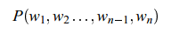

We can use the chain rule of probability to decompose this probability:

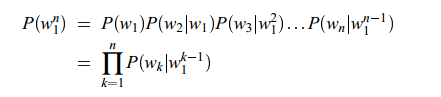

## C. **Bigram Model:**

In this model we approximate the probability of a word given all the previous words by the conditional probability of the preceding word.

 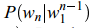 = 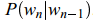

For a bigram grammar, then, we compute the probability of a complete string:

 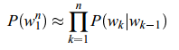

To calculate the probability, from this corpus we take the count of a particular bigram, and divide this count by the sum of all the bigrams that share the same first word.

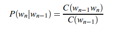

## D. **Trigram Model:**

A trigrammodel looks just the same as a bigram model, except that we condition on the two-previous words.

## E. **Minimum Edit Distance:**

The distance between two strings is a measure of how alike two strings are to each other. The minimum edit distance between two strings is the minimum number of editing operations (insertion, deletion, substitution) needed to transform one string into another.

 

Minimum edit distance is used in the correction of spelling mistakes or OCR errors, and approximate string matching, where the objective is to find matches for short strings in many longer texts.

## Implementation

**Designing a keyboard interface:**

The initial task was to design a keyboard interface as a web app. The keyboard layout consists of all keys which are present on a physical keyboard. The keyboard&#39;s interface will show the top three predictions for a given word sequence and suggest word-completion.

This interface was achieved by designing in HTML, CSS and dynamic behavior was made possible using JavaScript and AJAX.

 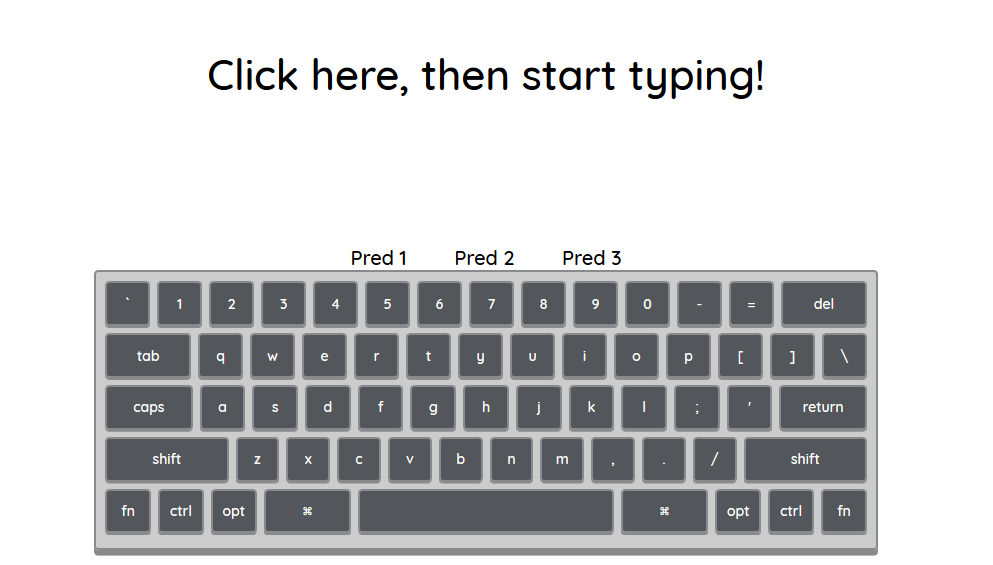
 
**Using Bigram and Trigram model to suggest predictions on the software keyboard:**

To predict words for a given a sequence, a bigram and a trigram module were implemented in python. The bigram module calculates the probability of occurrence of a word after a given string. This is achieved by storing all the possible words in the corpus which can follow a given previous word and the count of this bigram as a key-value pair in a hash map. The probability can be calculated by dividing the value (count) by the number of times the given word occurs in the corpus.

Similarly, the trigram module is stored as a hash map of hash maps consisting of the possible words following a sequence of words (two words) with their respective counts. Hash maps are used to achieve faster lookups.

**Using Minimum Edit Distance Module for auto-completion:**

Often in real world typing, a user may mistype a word, which an intelligent typing assistant should be able to suggest corrections for. This is implemented using the concept of Minimum Edit Distance between predictions and what the user typed. We implement this using dynamic programming that finds the minimum number of additions, subtractions, or substitutions required to covert one word to another. However, when using this module with the large number of words in the corpus, we realise that it is not very time-efficient. Hence in our final implementation, we use the nltk function for finding the Levenshtein distance between given words. We also allow unit transposition cost to factor in cases where the user may have typed &quot;fisrt&quot; instead of &quot;first&quot;, as is common in fast typing. We take all the possible predictions after the last completed word, and store them in an array. Then we find the distances between each prediction in the array and what the user has typed. We use a lambda function to sort these in ascending order and display the top results.

**Building a simple python server in flask:**

The probabilities will be calculated on the server and the top predictions will be sent to the client in response to the client&#39;s request.

 The code for the working of server has been summarized below:

_from flask import Flask, render\_template, jsonify,request_

_import simplejson as json_

_app = Flask(\_\_name\_\_)_

_@app.route(&#39;/output&#39;, methods=[&#39;GET&#39;])_

_def worker():_

_        #Implementation of brigram and trigram modules_

_       _

_        Returns predictions_

_if \_\_name\_\_==&quot;\_\_main\_\_&quot;:_

_    app.run()_

**Flow of the application:**

The following steps are executed in the application –

- User types a string on the keyboard.
- On every key press a AJAX request is sent to the python server with the request parameters being the string which has been typed till now.
- If space key is pressed, then the server extracts the parameters from the query string and calculates the possible predictions for the string sequence by using the bigram/trigram model and returns them in the response which the client populates in the keyboard interface.
- If space key is not pressed, then the server returns the auto-completions/spelling correction possible for the given word by using which of the n-gram word predictions previously made starts with the what the user is typing. If less than three such matches are found, the minimum edit distance module takes over and returns the remaining predictions, to make a total of three predictions at all times.
- These predictions are converted to JSON and sent to the keyboard module.
- The keyboard unwraps the JSON and puts the predictions over the keys.

## Results:

**Auto-Complete Suggestions:**

- If we type &quot;he&quot;, then the top three auto-complete predictions are &quot;heard&quot;, &quot;held&quot; and &quot;headed&quot;.

 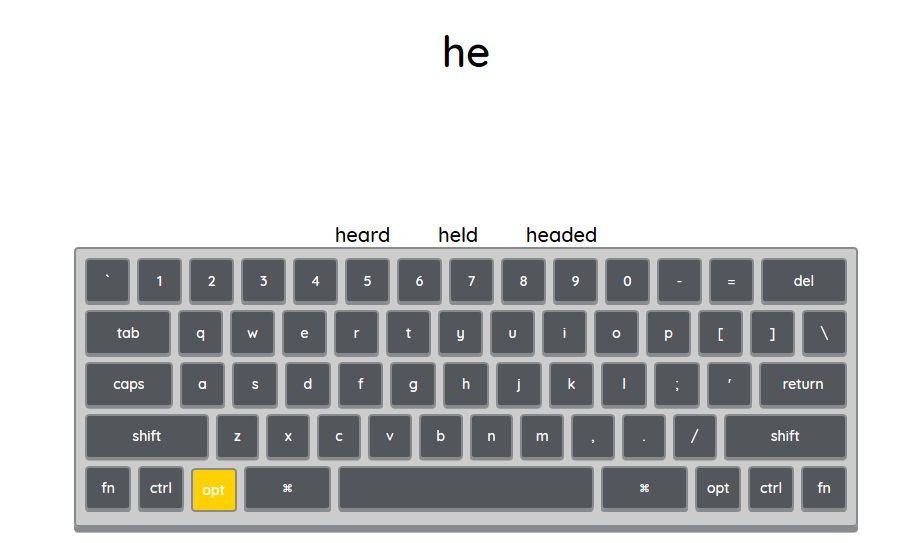

- When &quot;call m&quot; is typed, the suggestions are populated with the most common words beginning with &quot;m&quot; that are &quot;me&quot;, &quot;my&quot;, and &quot;myself&quot;.

 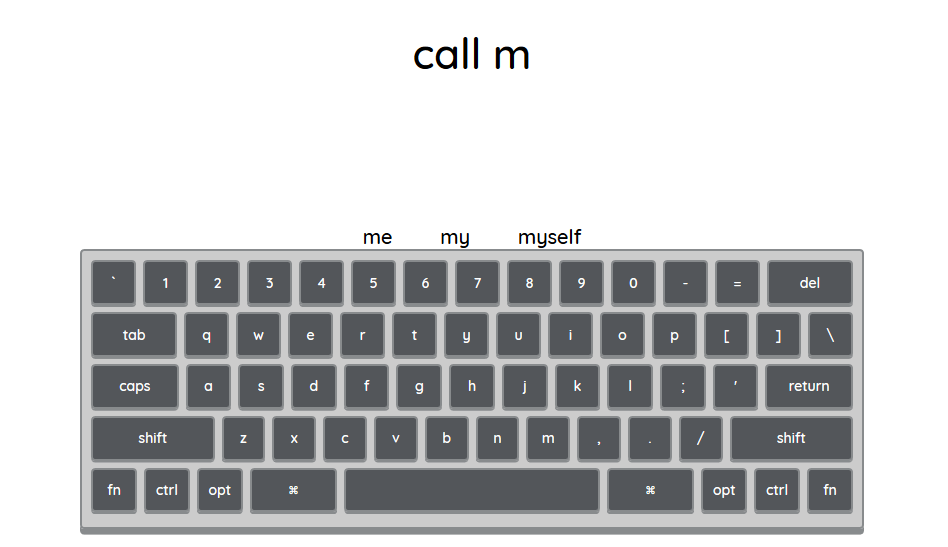

**Word Predictions:**

- Following screenshots show the word predictions for the word sequence starting with &quot;tell&quot;.

The top three words that can follow &quot;tell&quot; are &quot;you&quot;, &quot;him&quot; and &quot;me&quot;.

 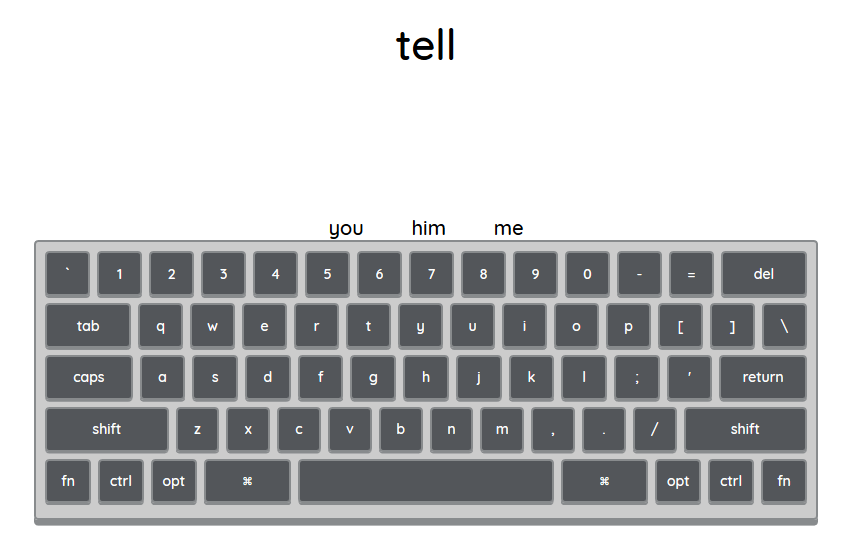

Word predictions for sequence &quot;tell me&quot; are &quot;more&quot;, &quot;me&quot; and &quot;a&quot;.

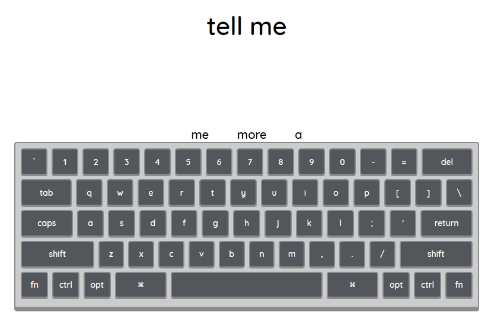

Top predictions for the word sequence &quot;tell me more&quot; are &quot;about&quot;, &quot;,&quot;, &quot;than&quot;. Punctuations are also predicted.

 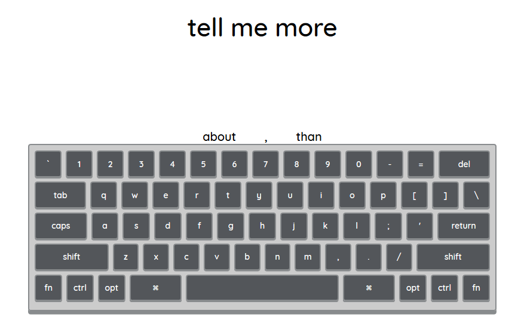

The top three words that can follow &quot;tell me more about&quot; are &quot;the&quot;, &quot;him&quot; and &quot;Gabriel&#39;s&quot;.

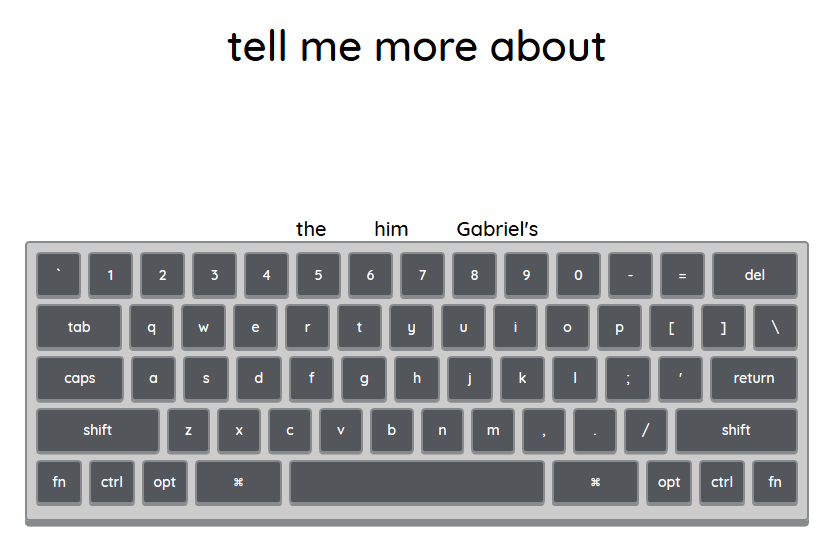

When &quot;hi&quot; is typed after &quot;tell me more about&quot;, auto-complete suggestions for &quot;hi&quot; are populated. This shows that both next-word prediction and auto-completion are working together.

 

From the above results it can be concluded that our implementation of

N-Gram model and minimum edit distance is capable of producing suggestions instantaneously thereby increasing the typing performance and reducing the user&#39;s efforts.

 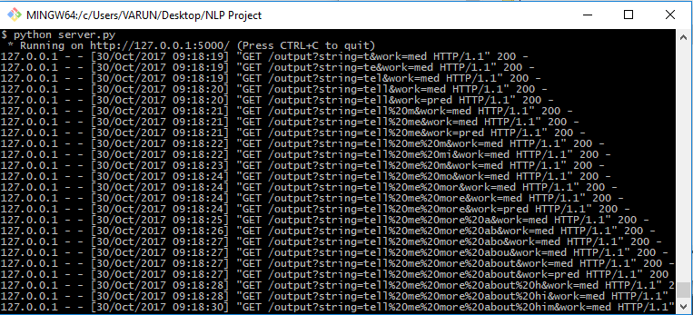

Screenshot of the requests received by the server

**Case Study:**

Most modern applications that rely on n-gram based models, such as machine translation applications, typically incorporate Bayesian inference. Modern statistical models are typically made up of two parts, a prior distribution describing the inherent likelihood of a possible result and a likelihood function used to assess the compatibility of a possible result with observed data. When a language model is used, it is used as part of the prior distribution.

N-gram find use in several areas of computer science, computational linguistics, and applied mathematics. It has been used for –

- Keyboards like GBoard and SwiftKey - adapts to the way the user types, so that user spends less time correcting their typos.
- Developing Systems for orally handicapped people -
